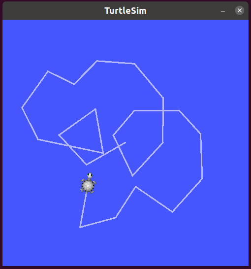
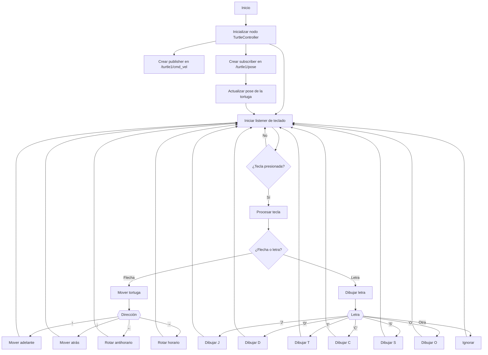

# Robotica2025-1_Laboratorio1
====
En este repositorio subiremos y administraremos los archivos correspondientes a la practica de laboratorio No. 1  Intro a ROS 2 Humble - Turtlesim

En este laboratorio veremos una introducción al uso de ROS2 mas especificamente, con el uso de turtlesim. Este software permite la creacion de "tortugas" (objetos) que realizaran movimientos deseados a partir del codigo fuente. Ya sea control directo, como movimiento por las flechas, o una rutina preestablecida.



En este caso crearemos un codigo que permita dibujar letras en mayuscula a partir de un ingreso por el usuario (presionar la tecla con la letra deseada). A continuación veremos el desarrollo y explicación de este:

### Procedimiento

Para el desarrollo del laboratorio tendremos en cuenta una serie de pasos para que sea efectivo:

1. **Inicialización del constructor:** Primero llamamos el constructor del nodo, además, creamos el PUBLISHER y el SUSCRIBER que son las funciones que nos permiten enviar y recibir los valores de posicion y velocidad de nuestra tortuga. En la inicialización del sistema tambien tenemos en cuenta la función de listener que permite recibir la información del teclado (usuario).

```python
listener = keyboard.Listener(
            on_press = self.boton_presionado,
            on_release = self.boton_liberado)
        listener.start()
```

2. **Funciones de movimiento:** Para poder mover la tortuga es necesario establecer el tipo de movimientos que va a hacer esta. Por ello, declaramos 5 funciones que nos permitiran mover la tortuga:
    - Hacia adelante
    ```python
    def mover_hacia_adelante(self, n, vel):
        for i in range(0, n):
            msg = Twist()
            msg.linear.x = vel
            msg.angular.z = 0.0
            self.publisher_.publish(msg)
            time.sleep(1)
            self.detener_movimiento()
    ```
    - Hacia atras
    ```python
    def mover_hacia_atras(self, n, vel):
        for i in range(0, n):
            msg = Twist()
            msg.linear.x = -vel
            msg.angular.z = 0.0
            self.publisher_.publish(msg)
            time.sleep(1)
            self.detener_movimiento()
    ```
    - Rotar a la derecha
    ```python
    def curva_derecha(self, n, velx):
        for i in range(0, n):
            msg = Twist()
            msg.linear.x = velx
            msg.angular.z = -3.1415926535897932384626433 / 2
            self.publisher_.publish(msg)
            time.sleep(1)
            self.detener_movimiento()
    ```
    - Rotar a la izquierda
    ```python
    def curva_izquierda(self, n, velx):
        for i in range(0, n):
            msg = Twist()
            msg.linear.x = velx
            msg.angular.z = 3.1415926535897932384626433 / 2
            self.publisher_.publish(msg)
            time.sleep(1)
            self.detener_movimiento()
    ```
    - Detener
    ```python
    def detener_movimiento(self):
        msg = Twist()
        msg.linear.x = 0.0
        msg.angular.z = 0.0
        self.publisher_.publish(msg)
    ```
La funcion para detener es la mas importante ya que nos permite actualizar el movimiento de la tortuga en un momento deseado. Y el resto de funciones tienen una base parecida, lo que cambia es su velocidad lineal (negativa en caso de ir hacia atras) y angular (0.0 en caso de ser hacia adelante y hacia atras).

3. **Función de orientación:** Esta función es fundamental en el sistema ya que esta permite mover la tortuga en aquellos casos en los que queremos crear una linea despues de la primera creada.
```python
def orientar(self, myTheta):
        client = self.create_client(TeleportAbsolute, '/turtle1/teleport_absolute')

        request = TeleportAbsolute.Request()
        request.x = self.pose.x
        request.y = self.pose.y
        request.theta = myTheta

        future = client.call_async(request)
        future.add_done_callback(self.orientacion_callback)
        time.sleep(1)
```
Aca vemos como se implementa la funcion TeleportAbsolute() siendo esta fundamental para obtener las coordenadas de la tortuga y a partir de esto, modificarla.

4. **Función dibujar:** Por ultimo, diseñaremos la funcion dedicada a dibujar las letras. Por cada una de las letras crearemos un caso distinto dentro de la función:

```python
def dibujar(self, letra):
        msg1 = Twist() # Crear mensaje
        msg1.angular.z = 0.0
        self.orientar(0.0) # Orientar para dibujar

        match letra:
            case 'j':
                self.get_logger().info("Dibujando letra J")
                # --
                self.mover_hacia_adelante(2, 1.0)
                self.mover_hacia_atras(1, 1.0)
                # |
                self.rotar_horario90(1)
                self.mover_hacia_adelante(2, 1.0)
                # ( )
                self.curva_derecha(2, 1.0)
            
            case 'd':
                self.get_logger().info("Dibujando letra D")
                # -
                self.mover_hacia_adelante(1, 1.0)
                # )
                self.curva_derecha(1, 1.0)
                self.orientar(-3.1415926535897932384626433 / 2)
                # |
                self.mover_hacia_adelante(2, 1.0)
                # )
                self.curva_derecha(1, 1.0)
                self.orientar(3.1415926535897932384626433)
                # -
                self.mover_hacia_adelante(1, 1.0)
                # |
                self.orientar(3.1415926535897932384626433 / 2)
                self.mover_hacia_adelante(1, 3.3)

            case 't':
                self.get_logger().info("Dibujando letra T")
                # --
                self.mover_hacia_adelante(2, 1.0)
                self.mover_hacia_atras(1, 1.0)
                # |
                self.rotar_horario90(1)
                self.mover_hacia_adelante(2, 1.0)
                
            case 'c':
                self.get_logger().info("Dibujando letra C")
                # (
                self.orientar(3.1415926535897932384626433)
                self.curva_izquierda(1, 2.0)
                # |
                self.orientar(-3.1415926535897932384626433 / 2)
                self.mover_hacia_adelante(1, 0.5)
                # (
                self.curva_izquierda(1, 2.0)
            case 's':
                self.get_logger().info("Dibujando letra S")
                self.orientar(3.1415926535897932384626433)
                self.curva_izquierda(2, 1.2)
                self.curva_derecha(2, 1.2)

                pass
            case 'o':
                self.get_logger().info("Dibujando letra O")
                self.curva_izquierda(4, 2.0)
            case _:
                self.get_logger().info("Letra no reconocida para dibujo")
```

Veremos el caso de la letra "J". Aca se realiza primero la linea superior con el comando *self.mover_hacia_adelante(2, 1.0)*, luego se devuelve por la misma linea para ubicarse justo en el centro de esta y asi rotar. Los comandos son estos:
```python
    self.mover_hacia_atras(1, 1.0)
    
    self.rotar_horario90(1)
```
Por ultimo, se mueve la tortuga hacia abajo en linea recta hasta completar una linea recta y cuando termina esta, crea una porción de un circulo para crear la curva inferior caracteristica de la letra "j". Como la tortuga se mueve hacia abajo, la curva la debe dar hacia la derecha, sin embargo, nosotros la vemos hacia la izquierda.
```python
    self.mover_hacia_adelante(2, 1.0)

    self.curva_derecha(2, 1.0)
```

### Diagrama de flujo

Se presenta el diagrama de flujo propuesto para la implementación del codigo:

